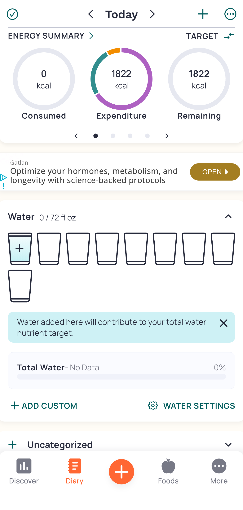
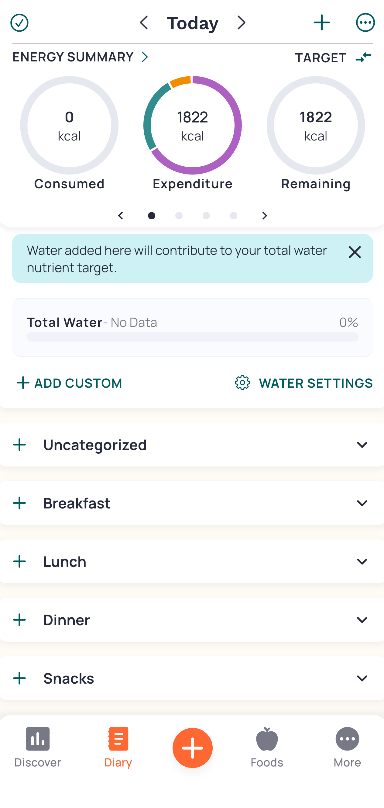
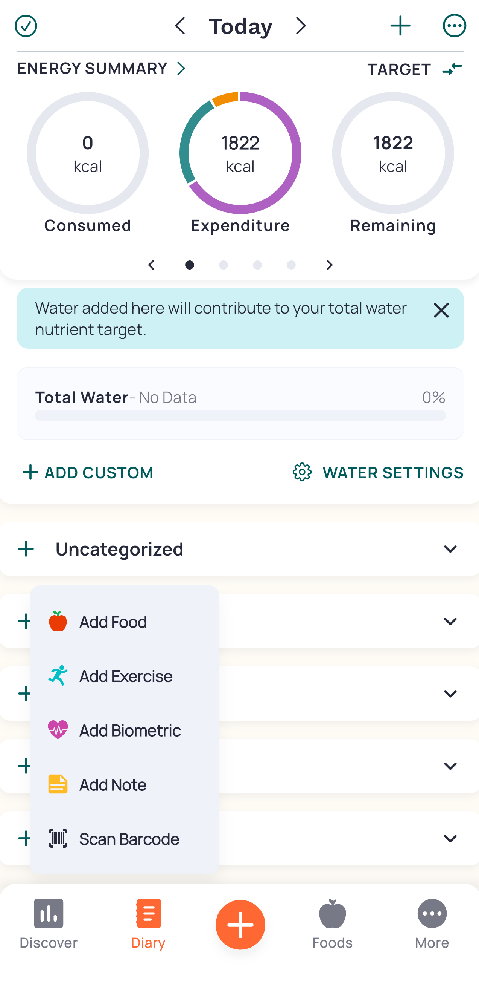
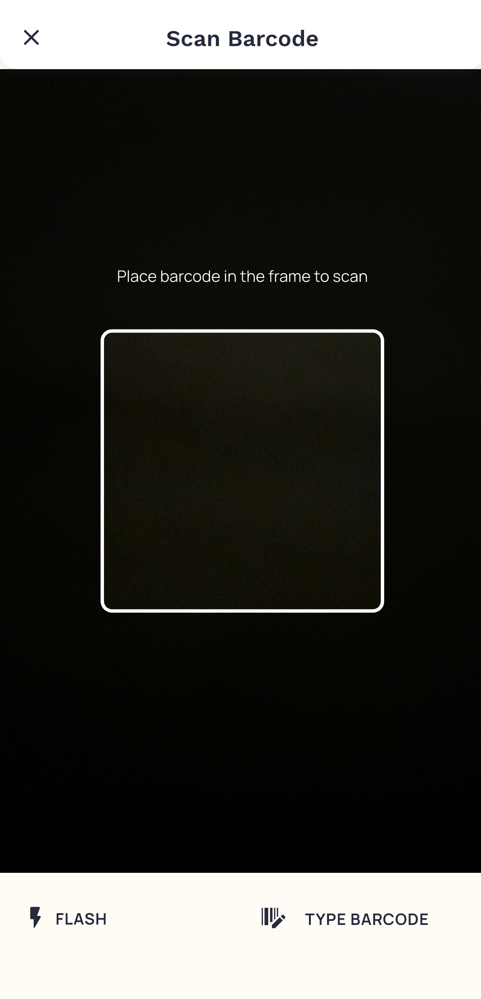
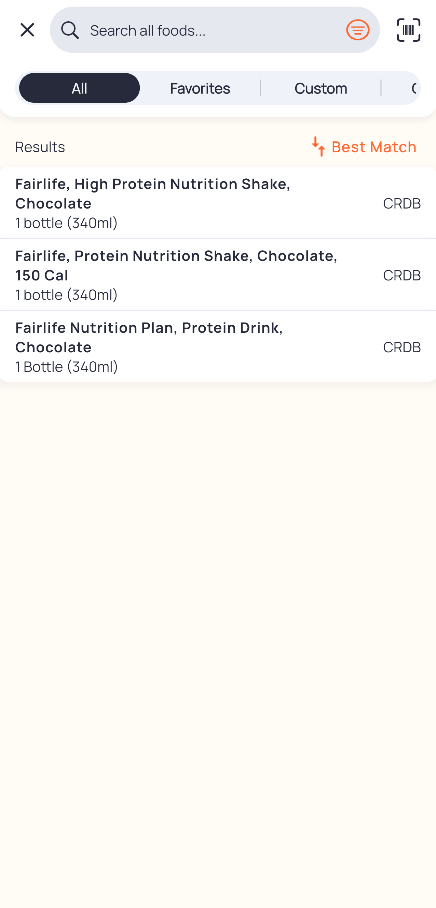
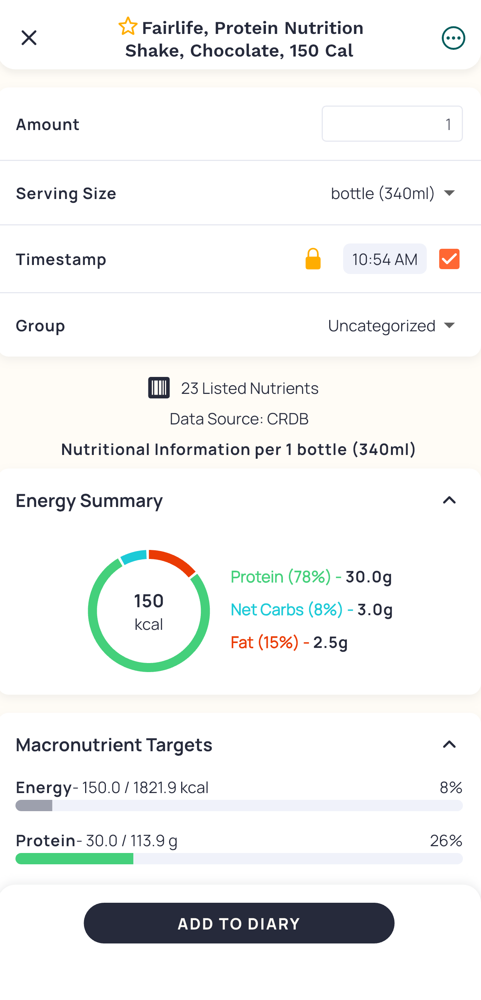
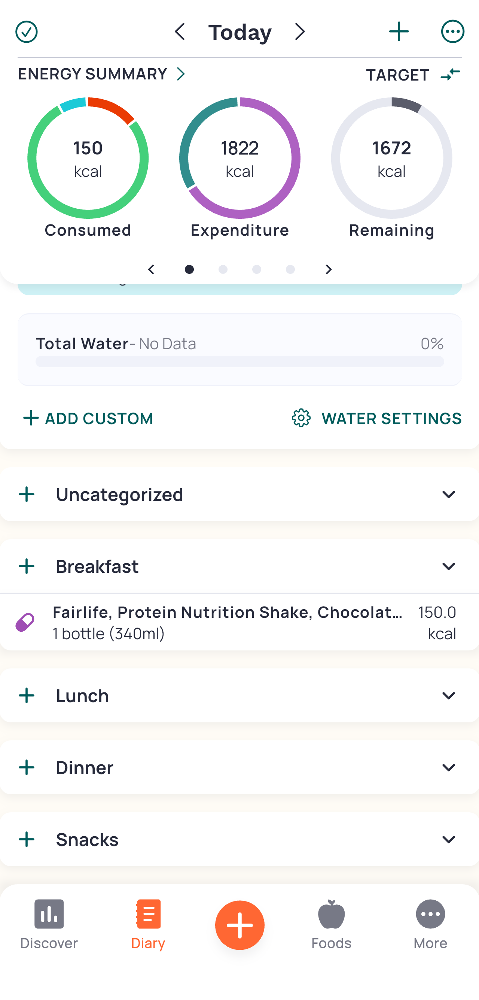

# Using Cronometer to track nutrition.
Nutrition tracking is one of my favorite tools to ensure I meet my nutritional requirements. Commonly many users start and go crazy for the first week but then quit due to apps being a hassle and getting to be a time sink. Cronometer is a case study in making the user have the least amount of friction to accomplish their task and go about their day.

## Step 1: Home

We start on the home screen where the User’s Conceptual Model is born from the circles we see under the Energy Summary. We can infer the app works by adding up all our food and see how much of this pie we have left.

## Step 2: Scrolls

## Step 3: Options

## Step 4: Barcode

## Step 5: Which One

## Step 6: Verify

## Step 7: Done

