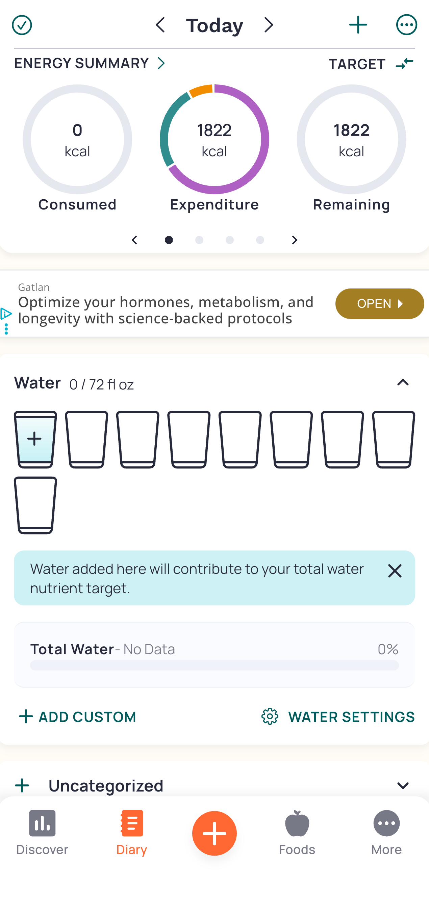
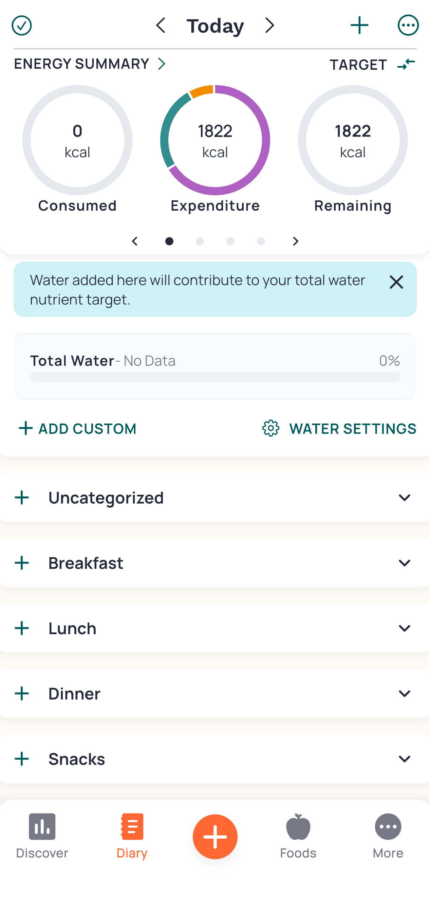
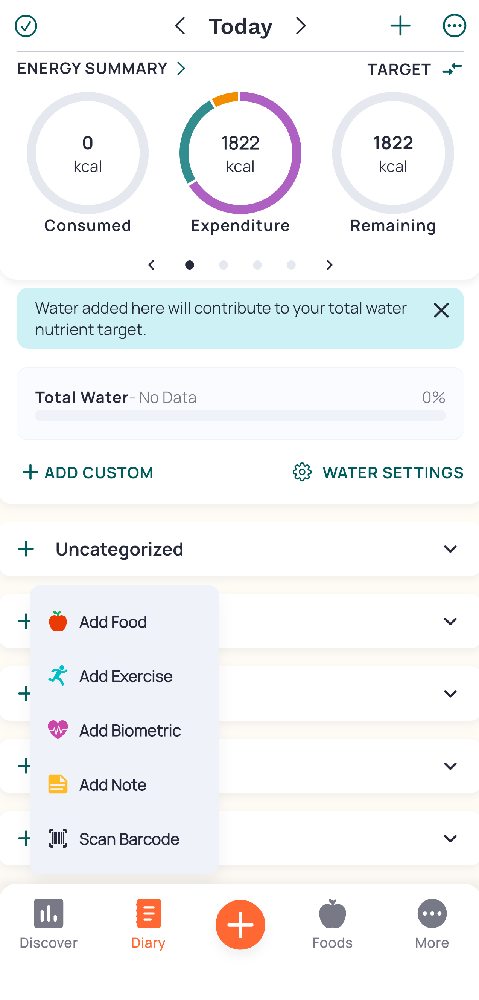
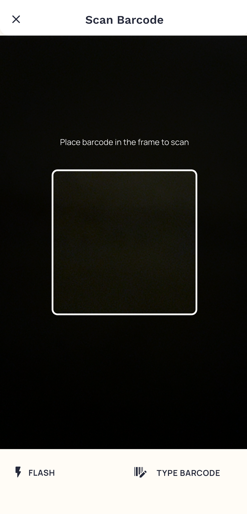
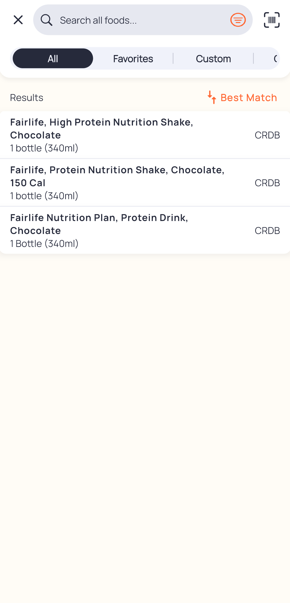
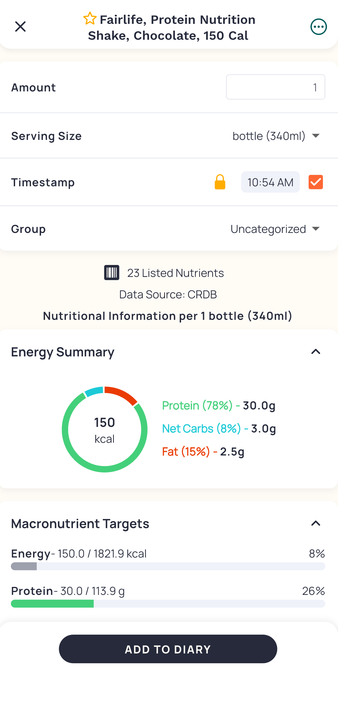
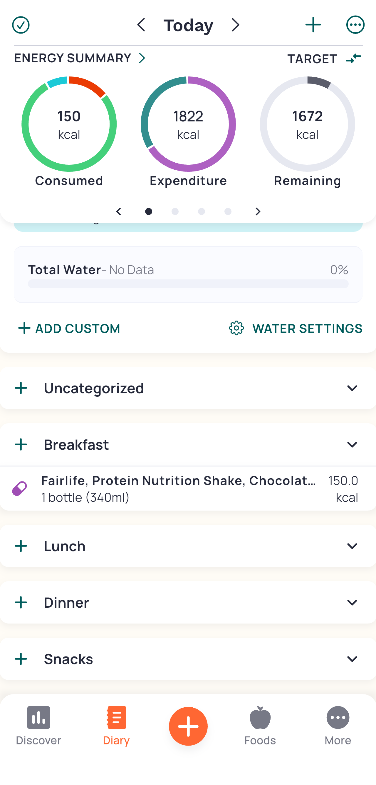

# j02 (Revised)
# Using Cronometer to track nutrition. (Revised)
Nutrition tracking is a vital tool for ensuring I meet my nutritional requirements. Commonly many people start using these apps but quickly stop due to them taking too long. Cronometer is a case study in having the least amount of friction to simply log food and go about your day.

## Step 1: Home
  

We start on the home screen where our **Conceptual Model** is born. From the circles we see under the Energy Summary, we can infer the app works by adding up all our food and displaying it into a pie that is growing.
We can see a clean and simple visual design that displays only the most important information. It does this without showing all micro nutrients and cluttering the page. Instead we just get the calorie tracker circles with more info available if we swipe left on that top bar.  

## Step 2: Scrolls
  
We scroll down and see separated lists for each meal. This displays **Constraints** where each food is grouped into a separate meal so we can clearly segment items visually.
**Affordances** here are plentiful, we see Plus (+) Signs everywhere allowing us to click on any of them to presumably add something. Upon clicking the + on “Breakfast”, options to add various data appear. I want to log a protein shake I just drank so I will click “Scan Barcode” as that seems the fastest.

## Step 3: Options
  
Once we click on the + button next to “Breakfast”, we have options that pertain to that meal time. This aligns with the User’s **Mental Model** and is a clear “Call to Action” button as each is labeled depending on what we want to add. I selected the barcode since I just want to scan a drink and be done with my logging for now.

## Step 4: Barcode
  
The camera instantly opens and we are in a scanning mode. This shows strong **Mapping** between the icon and the actual scanning (this icon is commonly associated with scanning at checkout in grocery stores). We get feedback right when you scan the bottle with a quick vibration and screen transition.

## Step 5: Which One
  
We see multiple options since that barcode brings up a couple entries in their database. We can quickly see the calories and serving size so I click on the 2nd option. Here the user’s **Mental Model** is put to the test since we would have to understand that each option would impact our final result. Thus, we need to choose the right one in these situations but, we can just click on any and as long as the info is right about the calories, serving size, and protein we are golden.

## Step 6: Verify
  
I can quickly see and review if this info, mainly calories and serving size, match my bottle. It does! So I click add to my diary. This is the last layer of **Constraint** that allows the user to prevent incorrect additions.

## Step 7: Done
  
I can now see my new entry is showing up and it reflects in the circles above. The circles act as a **Natural Mapping** since it’s reminiscent of a pie. The slice is “growing” as you log more. The best part however is the fast visual lookup. We can quickly see how much more we can have at a glance, without having to even do the math in your head, or navigate to the more complex menus.
